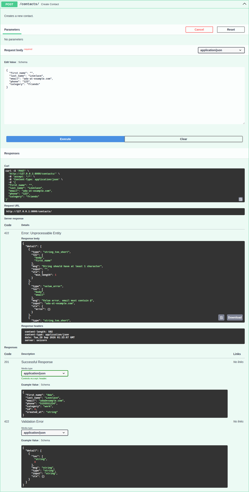

# Validated Contact Book (L3)

A FastAPI contact book that uses Pydantic v2 schemas with several layers of
validation: field length constraints, a custom email validator, an Enum for
category, and separate schemas for create, update and response.

## Project structure

```
validated-contacts/
├── app/
│   ├── __init__.py
│   ├── main.py              # FastAPI app; includes the contacts router at /contacts
│   ├── routers/
│   │   ├── __init__.py
│   │   └── contacts.py      # POST, GET (list + filter), GET by id, PATCH
│   └── schemas/
│       ├── __init__.py
│       └── contact.py       # ContactCategory, ContactCreate, ContactUpdate, ContactResponse
├── tests/
│   ├── __init__.py
│   └── test_contacts.py     # 50 pytest cases
├── docs/
│   └── swagger-422-error.png
├── .gitignore
├── requirements.txt
└── README.md
```

## Setup and run

From the `validated-contacts/` folder:

```bash
pip install -r requirements.txt
uvicorn app.main:app --reload
```

Then open http://127.0.0.1:8000/docs for Swagger UI.

## Schemas (`app/schemas/contact.py`)

| Schema | Purpose |
|---|---|
| `ContactCategory` | `str` Enum with values `personal`, `work`, `family` |
| `ContactCreate` | `first_name` and `last_name` (required, 1–50 chars), `email` (required, must contain `@` via `@field_validator`), `phone` (optional, 10–15 chars), `category` (required `ContactCategory`) |
| `ContactUpdate` | The same fields, all optional, with the same constraints applied to any field that is sent |
| `ContactResponse` | Extends `ContactCreate` with `id: int` and `created_at: str`; sets `model_config = ConfigDict(from_attributes=True)` |

## Endpoints (`app/routers/contacts.py`)

| Method | Path | Description | Success | Errors |
|---|---|---|---|---|
| POST | `/contacts/` | Create a contact | 201 | 422 invalid body |
| GET | `/contacts/` | List contacts; optional `?category=work` | 200 | 422 invalid category |
| GET | `/contacts/{id}` | Get one contact | 200 | 404 not found, 422 non-integer id |
| PATCH | `/contacts/{id}` | Update only the fields sent (`model_dump(exclude_unset=True)`) | 200 | 404 not found, 422 invalid value or `null` for a required field |

Contacts are stored in memory, so they reset when the server restarts.

## Validation in Swagger UI (422 example)

Sending this body to `POST /contacts/`:

```json
{
  "first_name": "",
  "last_name": "Lovelace",
  "email": "ada-at-example.com",
  "phone": "123",
  "category": "friends"
}
```

returns **422 Unprocessable Entity**, with one entry per problem: `first_name`
too short, `email must contain @`, `phone` too short, and `category` not one of
`personal`, `work`, `family`.



## Tests

```bash
pytest -v
```

`tests/test_contacts.py` uses a shared `request()` helper that checks the status
code before reading the response body and turns client errors into readable
test failures. Returned values are compared against what was sent, not just
checked for presence. The storage is reset before every test.

Coverage includes:

- Creating contacts and checking every returned field matches the input
- Boundary lengths accepted (1 and 50 char names, 10 and 15 char phones) and rejected (0/51 chars, 9/16 chars)
- Custom email validator message, invalid categories, missing required fields, wrong types, multiple errors in one request
- Failed creates don't store anything
- Listing, category filtering, empty filter results, invalid filter value
- Get by id, 404 for unknown id, 422 for a non-integer id
- PATCH changing only the sent fields (others unchanged and persisted), clearing the optional phone, rejected updates leaving the record untouched, 404 for unknown id
- OpenAPI schema documents the routes, length constraints, enum values and response fields
